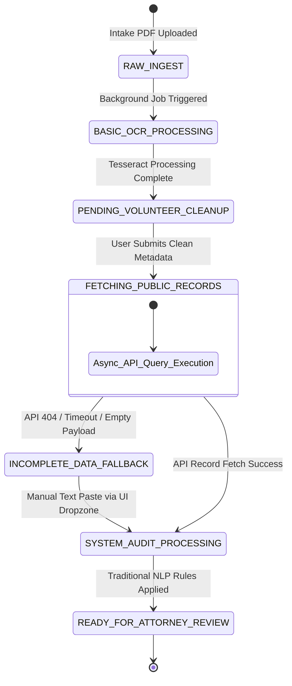
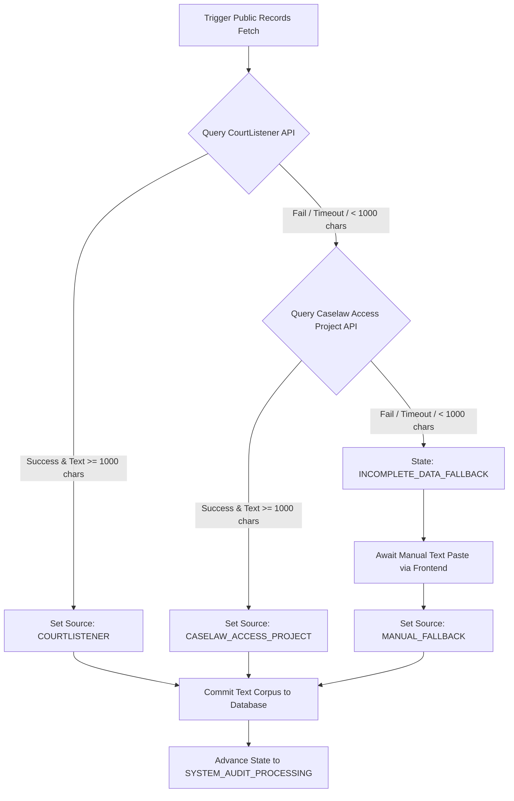

# Technical & Functional Specification: Operation Innocence Intake MVP
## 1. Executive Summary & Core Philosophy
### 1.1 Problem Statement
Innocence organizations struggle with severe backlogs due to highly manual initial intake processes. Existing automated legal triage tools rely heavily on black-box scoring algorithms that optimize for "quick wins" and high probability scores. This systematically buries complex, systemic wrongful conviction cases (such as subtle prosecutorial misconduct or hidden evidence) beneath simple cases.
### 1.2 The No-Score Principle
This system **must never** assign a statistical probability of success or an overall exoneration score to a case. Instead, it functions purely as an **Objective Feature Extraction Matrix**. It highlights specific, unweighted factual and procedural anomalies within the trial record, allowing human attorneys to filter and evaluate cases based on clinical criteria rather than predictive metrics.
### 1.3 User Persona
 * **Attorney Volunteer:** A single unified user role. This user handles the intake document ingestion, audits and corrects basic metadata errors synchronously, manages the text-gathering step, and analyzes the resulting feature flags in a unified workspace layout.
## 2. System Architecture & Tech Stack
The MVP must be built entirely using a lightweight, synchronous backend rendering layer with asynchronous task processing for long-running I/O operations (OCR and API fetching).
 * **Backend Framework:** Python 3.11+ with FastAPI.
 * **Asynchronous Task Handling:** Python standard library asyncio or simple background tasks (fastapi.BackgroundTasks) for non-blocking I/O operations.
 * **Frontend UI:** Tailwind CSS integrated via standard HTML5 / Jinja2 web templates (No Streamlit async state rendering).
 * **OCR Engine:** Tesseract OCR (pytesseract) for standard deterministic text extraction.
 * **NLP Pipeline:** Traditional, deterministic Natural Language Processing utilizing spaCy (for sentence tokenization/lemmatization) and Python regular expressions (re).
 * **Database:** SQLite (Single file-based instance, initialized via local schema).
## 3. State Machine & Workflow Lifecycle
Every case file processed by the system must progress through an explicit, auditable sequence of states. External data acquisition and OCR operations must be non-blocking.

### 3.1 Detailed State Definitions
 1. **RAW_INGEST**: Scanned PDF intake forms are uploaded via the frontend web interface.
 2. **BASIC_OCR_PROCESSING**: Tesseract parses the PDF. If processing hangs or fails for greater than 180 seconds, the system aborts and flags an error.
 3. **PENDING_VOLUNTEER_CLEANUP**: The system presents a side-by-side Tailwind view. The original PDF displays on the left; the editable metadata fields display on the right for manual validation.
 4. **FETCHING_PUBLIC_RECORDS**: **[ASYNCHRONOUS STATE]** Triggered instantly when the volunteer submits the cleaned metadata. The frontend renders a loading spinner while an async background worker queries external legal APIs. The user is free to navigate away; the process does not block the application.
 5. **INCOMPLETE_DATA_FALLBACK**: Triggered if the async worker times out or external APIs return 404 or insufficient text (less than 1,000 characters). The UI opens a manual text dropzone allowing the Attorney Volunteer to paste raw text from appellate briefs.
 6. **SYSTEM_AUDIT_PROCESSING**: The traditional NLP pipeline runs a proximity-matching sweep against the compiled text corpus.
 7. **READY_FOR_ATTORNEY_REVIEW**: The case is unlocked on the master dashboard, showcasing its raw feature matrix array with zero scoring bias.
## 4. Open Data Sources & Acquisition Routing
The application leverages four distinct data endpoints and repositories to compile case records, evaluate forensic validity, and audit systemic actor integrity.
### 4.1 CourtListener API (Free Law Project)
 * **Purpose:** Primary retrieval network for modern state and federal appellate court dockets and written opinions.
 * **Implementation:** The system hits the /dockets and /opinions endpoints using the normalized metadata (Defendant Name, State, County, Year, Docket Number) verified in Step 3. The plain text (plain_text or html_with_citations field stripped of HTML tags) is downloaded and saved to the case file text corpus.
### 4.2 Caselaw Access Project (CAP) API (Harvard Law School)
 * **Purpose:** Historical fallback network. Essential for retrieving digitized state appellate court opinions from older or legacy jurisdictions (pre-2000s) that modern state court dockets often emit.
 * **Implementation:** Queried concurrently or sequentially during the FETCHING_PUBLIC_RECORDS async phase if modern dockets return null responses.
### 4.3 The National Registry of Exonerations (NRE) Core Database Dump
 * **Purpose:** The foundational lookup index for identifying systemic bad actors and seeding the integration test environment.
 * **Implementation:** Hosted locally as an embedded data table (data/nre_misconduct.db). It contains pre-calculated registries of known prosecutors, judges, and forensic analysts tied to documented official misconduct (OM) and false forensic science (FC) cases.
### 4.4 Local Debunked Forensic Science Reference Database
 * **Purpose:** A localized diagnostic taxonomy used to isolate, identify, and categorize unvalidated or completely discredited forensic disciplines present in the trial record.
 * **Implementation:** Compiled as a static configuration matrix (app/config/junk_science.json) mapped directly from the consensus findings of the **2009 National Academy of Sciences (NAS) Report** and the **2016 PCAST Forensic Validity Report**. It defines the core evaluation criteria for disciplines like microscopic hair comparisons, bite mark analysis, bullet lead analysis, and outdated arson indicators.
### 4.5 Source Prioritization, Schema Population, and Fallback Routing
#### 4.5.1 Priority Hierarchy Matrix

 * **Priority 1: CourtListener (API Primary):** The background worker must first query CourtListener. If matching dockets are found *and* the returned opinion text is structurally viable (greater than or equal to 1,000 characters), the search concludes successfully.
 * **Priority 2: Caselaw Access Project (API Secondary Fallback):** If CourtListener returns a 404 error, a timeout, or a null text body, the async worker automatically formats and executes a secondary query to the CAP API.
 * **Priority 3: Manual Fallback Dropzone (User Final Fallback):** If both external API endpoints fail to resolve text, the async loop terminates cleanly. The case state transitions to INCOMPLETE_DATA_FALLBACK, surface-level background alerts display to the user, and the UI unlocks the plain-text manual ingestion block.
#### 4.5.2 Schema Population Rules
Once a text corpus is successfully populated (via external API or manual text paste), the case transitions into SYSTEM_AUDIT_PROCESSING. The local databases are used to populate the Pydantic schema model as follows:
 * **Text Ingestion Metadata:** The text payload is saved to raw_text_payload, and text_corpus_source is set to COURTLISTENER, CASELAW_ACCESS_PROJECT, or MANUAL_FALLBACK.
 * **Systemic Actors / Misconduct:** The text is scraped for proper names associated with legal roles. These names are cross-referenced against the local nre_misconduct.db. If a name matches an individual with a documented history of official misconduct within that state's jurisdiction, the system populates the CaseActor model array, flipping matched_in_misconduct_registry to True.
 * **Forensic Vulnerabilities:** The nlp_processor.py passes the text corpus against the anchor terms listed in app/config/junk_science.json. If a keyword window match occurs (e.g., "microscopic hair" matches near "expert testimony"), the system appends the corresponding enum to the detected_disciplines array, changes has_junk_science to True, and dumps the sentence snippet containing the hit directly into the source_quotes field of the ForensicFlags model.
#### 4.5.3 Asynchronous Execution & Fallback Logic Loop
The coding agent must implement the background routing mechanism in app/api_scraper.py following this logical execution structure:
```python
import asyncio
from typing import Optional, Tuple

async def execute_asynchronous_data_acquisition(case_id: str, query_params: dict):
    # Establish initial transaction context
    db.update_case_status(case_id, "FETCHING_PUBLIC_RECORDS")
    
    raw_text: Optional[str] = None
    source_used: Optional[str] = None
    
    # ---- PRIORITY 1: COURTLISTENER ----
    try:
        raw_text = await query_courtlistener_async(query_params)
        if raw_text and len(raw_text) >= 1000:
            source_used = "COURTLISTENER"
    except Exception as e:
        logger.warning(f"CourtListener fetch failed for case {case_id}: {str(e)}")
        
    # ---- PRIORITY 2: CASELAW ACCESS PROJECT (FALLBACK) ----
    if not source_used:
        try:
            raw_text = await query_cap_async(query_params)
            if raw_text and len(raw_text) >= 1000:
                source_used = "CASELAW_ACCESS_PROJECT"
        except Exception as e:
            logger.warning(f"CAP fetch failed for case {case_id}: {str(e)}")
            
    # ---- EVALUATE ACQUISITION OUTCOME & ROUTE STATE ----
    if source_used and raw_text:
        # Commit text to schema and advance to NLP audit
        db.save_ingested_text_corpus(
            case_id=case_id, 
            text_payload=raw_text, 
            source_enum=source_used
        )
        db.update_case_status(case_id, "SYSTEM_AUDIT_PROCESSING")
        
        # Trigger the traditional NLP calculation worker thread
        trigger_nlp_vulnerability_sweep(case_id)
    else:
        # Halt execution pipeline and route to Manual UI Fallback View
        db.update_case_status(case_id, "INCOMPLETE_DATA_FALLBACK")

```
## 5. Feature Extraction & Data Schema
The system uses a rigid, structured schema to track extracted anomalies. The following Pydantic V2 definitions serve as the absolute data model layout for the SQLite database.
```python
from enum import Enum
from typing import List, Optional
from pydantic import BaseModel, Field

class DefenseStrategyType(str, Enum):
    SELF_DEFENSE = "SELF_DEFENSE"
    CONSENT = "CONSENT"
    INSANITY = "INSANITY"
    PROVOCATION = "PROVOCATION"
    ALIBI_ONLY = "ALIBI_ONLY"
    MISTAKEN_IDENTITY = "MISTAKEN_IDENTITY"
    NOT_APPLICABLE = "NOT_APPLICABLE"

class JunkScienceType(str, Enum):
    MICROSCOPIC_HAIR = "MICROSCOPIC_HAIR_COMPARISON"
    BITE_MARK = "BITE_MARK_ANALYSIS"
    OUTDATED_ARSON = "OUTDATED_ARSON_FIRE_SCIENCE"
    BULLET_LEAD = "COMPARATIVE_BULLET_LEAD_ANALYSIS"
    BLOOD_SPATTER_OVERSTATE = "OVERSTATED_BLOODSTAIN_PATTERN"
    SHAKEN_BABY = "SHAKEN_BABY_SYNDROME"
    OTHER_UNVALIDATED = "OTHER_UNVALIDATED_FORENSICS"

class MisconductType(str, Enum):
    BRADY_VIOLATION = "BRADY_WITHHELD_EXCULPATORY_EVIDENCE"
    BATSON_CHALLENGE = "BATSON_RACIAL_JURY_EXCLUSION"
    PROSECUTORIAL_OVERREACH = "PROSECUTORIAL_INFLAMMATORY_MISCONDUCT"
    JUDICIAL_BIAS = "JUDICIAL_OVERREACH_OR_BIAS"

class ActorRole(str, Enum):
    PROSECUTOR = "PROSECUTOR"
    JUDGE = "JUDGE"
    DETECTIVE = "DETECTIVE"
    FORENSIC_ANALYST = "FORENSIC_ANALYST"

class BaseFlag(BaseModel):
    is_detected: bool = False
    source_quotes: List[str] = Field(default_factory=list)
    context_justification: Optional[str] = None

class CaseActor(BaseModel):
    name: str
    role: ActorRole
    matched_in_misconduct_registry: bool = False
    registry_source_notes: Optional[str] = None

class ViabilityFlags(BaseModel):
    defense_strategy_incompatibility: BaseFlag  # Flags Self-Defense/Consent
    primary_defense_strategy: DefenseStrategyType = DefenseStrategyType.NOT_APPLICABLE
    biological_evidence_availability: BaseFlag  # Flags DNA, semen, blood, clothing
    is_life_or_death_sentence: bool = False

class EvidentiaryVulnerabilities(BaseModel):
    incentivized_testimony: BaseFlag           # Flags snitches/deals
    cross_racial_eyewitness_id: BaseFlag       # Flags cross-racial ID markers
    single_witness_conviction: BaseFlag        # Conviction rests on 1 person
    vulnerable_defendant_confession: BaseFlag   # Minors, long interrogations (>6hrs)

class ForensicFlags(BaseModel):
    has_junk_science: bool = False
    detected_disciplines: List[JunkScienceType] = Field(default_factory=list)
    analysis_details: BaseFlag

class SystemicViolations(BaseModel):
    ineffective_assistance_of_counsel: BaseFlag
    alibi_failure: BaseFlag
    constitutional_misconduct_claims: List[MisconductType] = Field(default_factory=list)
    misconduct_details: BaseFlag

class CaseAnalysisReport(BaseModel):
    case_id: str
    defendant_name: str
    jurisdiction_state: str
    jurisdiction_county: str
    conviction_year: int
    text_corpus_source: str                     # Tracks source origin matrix
    raw_text_payload: str                       # Full raw text storage block
    case_actors: List[CaseActor] = Field(default_factory=list)
    viability: ViabilityFlags
    evidentiary_vulnerabilities: EvidentiaryVulnerabilities
    forensics: ForensicFlags
    systemic_violations: SystemicViolations

```
## 6. Traditional NLP Logic & Rules Engine
To replace LLMs, the backend implements a token-proximity matching algorithm managed via external config files (config/rules.json and config/junk_science.json).
### 6.1 The Proximity-Match Execution Method
 1. The text is stripped of line breaks, lemmatized, and split into sentence arrays using spaCy.
 2. A sliding window scanner checks for target keywords. A flag triggers only if an **Anchor Term** and an **Assertive Modifier** appear within a specific index distance of each other.
### 6.2 config/rules.json Layout Struct
The agent must load this configuration layout to execute token scanning:
```json
{
  "incentivized_testimony": {
    "anchor_terms": ["informant", "snitch", "co-defendant", "cellmate"],
    "assertive_modifiers": ["testified", "deal", "leniency", "immunity", "plea", "dropped"],
    "word_window_distance": 5
  },
  "brady_violation": {
    "anchor_terms": ["brady", "withheld", "suppressed", "undisclosed"],
    "assertive_modifiers": ["evidence", "favorable", "exculpatory", "prosecution"],
    "word_window_distance": 7
  }
}

```
### 6.3 config/junk_science.json Taxonomy Struct
The forensic validation pipeline uses this dedicated schema lookup matrix to detect junk science:
```json
{
  "MICROSCOPIC_HAIR_COMPARISON": {
    "anchor_terms": ["hair", "fiber", "microscopic"],
    "assertive_modifiers": ["match", "similar", "characteristics", "microscope", "expert"],
    "word_window_distance": 8
  },
  "BITE_MARK_ANALYSIS": {
    "anchor_terms": ["bite", "teeth", "dental", "odontologist", "dentistry"],
    "assertive_modifiers": ["match", "expert", "certainty", "impression", "mould"],
    "word_window_distance": 10
  },
  "COMPARATIVE_BULLET_LEAD_ANALYSIS": {
    "anchor_terms": ["bullet", "lead", "composition", "ammunition"],
    "assertive_modifiers": ["batch", "melt", "box", "chemical", "source"],
    "word_window_distance": 6
  }
}

```
### 6.4 Named Entity Resolution (NER) Lookups
The engine must parse the text for proper names preceding specific titles ("Judge [Name]", "ADA [Name]", "Detective [Name]"). Once isolated, the script queries a normalized lookup database seeded from **The National Registry of Exonerations (NRE) Official Misconduct Dataset**. If a string distance match occurs within a Levenshtein distance threshold \le 2 inside the same state jurisdiction, a matched_in_misconduct_registry = True attribute is appended to that actor.
## 7. QA Strategy & NRE Testing Fixture
To verify the NLP rules without manual user testing, the agent must implement an automated integration test runner (tests/test_nre_fixture.py).
### 7.1 The Test Runner Pipeline Execution
 1. The script loads a test matrix containing 50 public domain case text profiles downloaded from the NRE archive.
 2. Each text file has a corresponding static target JSON file representing the ground-truth tags mapped directly to NRE's baseline indicators (Snitch, FC [Forensic Evidence], OM [Official Misconduct], MWID [Mistaken Witness ID]).
 3. The script executes nlp_processor.py against the text and asserts outputs against the NRE ground truth.
 4. The test run outputs a standard **Confusion Matrix Dashboard** to the console detailing exact precision and recall metrics.
The test runner measures algorithmic safety using the standard Recall formula:
The test suite must enforce a minimum **100% recall limit for core junk science markers** before allowing code compilation or deployment merges.
## 8. Target Directory Structure
The coding agent must build the repository exactly to this modular file structure layout:
```text
innocence-intake-mvp/
│
├── app/
│   ├── __init__.py
│   ├── main.py                 # FastAPI application routes & template rendering
│   ├── database.py             # SQLite connection initialization, sessions, and schemas
│   ├── ocr_engine.py           # pytesseract PDF handling logic
│   ├── api_scraper.py          # Async background worker for CourtListener / CAP fetching
│   ├── nlp_processor.py        # Proximity token window tracking logic
│   │
│   ├── templates/
│   │   ├── base.html           # Main Tailwind framework inclusion layout
│   │   ├── workspace.html      # Side-by-side verification interface (Step 3)
│   │   └── dashboard.html      # Final matrix display panel (First-In, First-Out layout)
│   │
│   └── config/
│       ├── rules.json          # Dictionary arrays managing procedural boundaries
│       └── junk_science.json   # Static taxonomy managing unvalidated forensics rules
│
├── tests/
│   ├── __init__.py
│   ├── test_nre_fixture.py     # Batch text integration confusion matrix runner
│   └── mock_data/              # Isolated NRE text corpora and answer sheets
│
├── data/
│   └── nre_misconduct.db       # Embedded local lookup file tracking corrupt entities
│
├── requirements.txt            # Package configurations (fastapi, uvicorn, pytesseract, spacy, pydantic)
└── README.md                   # Initialization commands and setup protocols

```
