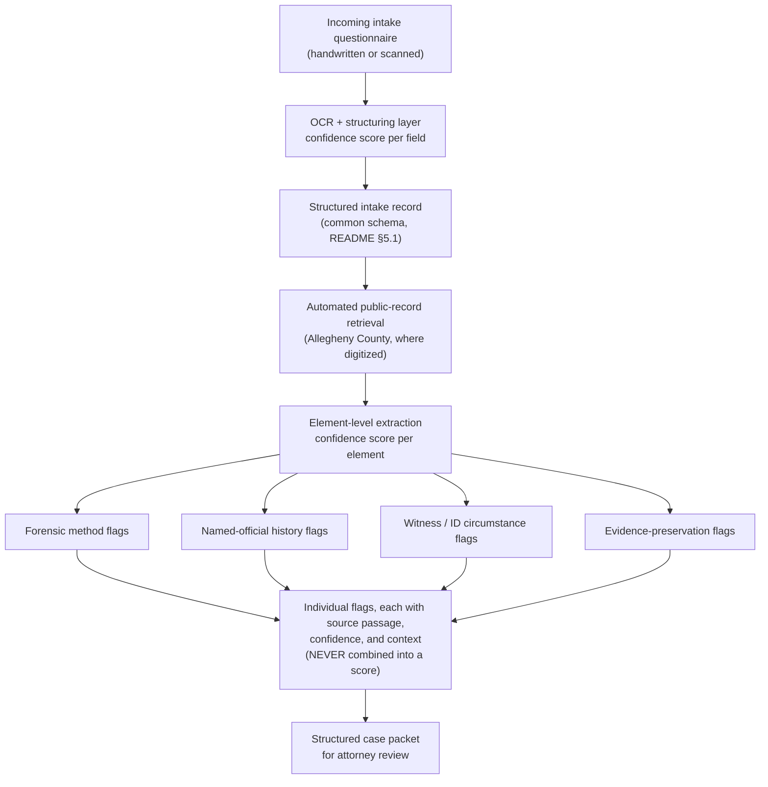

# Spec v3: Triage & Effort-Allocation Assistant

**Status:** Draft for review (v3 — extends, does not replace, README v2)
**Relationship to README v2:** README v2 is the constitution. Every constraint it
sets (§3.1 no case-level score, §3.2 no synthetic negative labels, §5.1 the Common
Intake Schema, §5.2 element flag categories and sources, §6.5 named-official fairness,
§6.6 gaps ≠ clean) is binding here. This document specifies *what we build next* and
*how* the pieces fit; where it appears to conflict with README v2, README v2 wins.
**Document owner:** Xuxoramos
**Date:** 2026-07-01

---

## 1. Product Vision

The product is **a tool that assists the Innocence Project in assigning effort and
resources to the large volume of cases that ask for their help.** It is a triage and
processing assistant, not a risk scorer and not a case ranker.

The bottleneck it targets is intake processing: turning a handwritten questionnaire and
an inconsistent pile of records into a structured, reviewable case file, then surfacing
the individual, independently-checkable facts a reviewer needs to decide where to spend
scarce attorney time.

### 1.1 Non-goals (inherited from README v2)

- **No case-level score, rank, or "ease of winning" estimate** (§3.1). Everything the
  engine emits is descriptive and per-element. A reviewer, not the engine, forms the
  overall judgment.
- **No synthetic negative labels, fabricated matches, or invented narrative** (§3.2).
  We never assert that a real, named person was probably wrongfully convicted.
- **No treating gaps as clean** (§6.6). "No record found" and "no flag found" are
  states of missing information, rendered as such, never as exoneration of the case.

### 1.2 Why the registry backfill exists

We have no access to real Innocence Project intake forms. So we backfill National
Registry of Exonerations (NRE) records *as if they were cases submitted to the IP*,
then simulate the intake of new cases on top of that population. The backfill is a
demo substrate, not ground truth about live cases.

---

## 2. The Triage Principle (descriptive / assistive, per element)

The engine describes each case element on its own terms and stops there:

- Each flag names one narrow, verifiable fact, with its own **source** and **basis**.
- Flags are **never aggregated** into a case number, tier, or rank (§3.1).
- Where the engine adds a *severity* or *frequency* descriptor (see automation point 4),
  that descriptor stays **attached to the single element** ("this file cites a Tier-A
  discredited method"; "this named analyst has 3 prior formal findings"). It is a label
  a reviewer reads, not a score the engine sums.
- Registry base rates (e.g. "official misconduct appears in ~54% of exonerations") are
  shown only as **labeled context for reviewer attention**, never as a per-case
  multiplier.

This is the reconciliation with §3.1: point 4 adds *descriptive weight to individual
elements*, it does not add a case-level judgment.

---

## 3. Automation Points

The product is four automation points layered on the existing engine. For each: current
state in the codebase, the gap, and the design.

### 3.1 Point 1 — Upload & structure a scanned intake form

**Goal.** A reviewer uploads a scanned PDF of a filled-in intake questionnaire. The
system OCRs and parses it, prefills the web intake form with the parsed values, and
shows the **original uploaded PDF in a scrollable viewer next to the form** so the
reviewer can check each parsed value against the source page before saving. Manual entry
(no upload) stays fully supported. Fields offer autocomplete backed by registry
dictionaries.

**Current state.**
- Web intake form exists (`ui/templates/index.html`, `ui/app.py` `/` route, driven by
  `form_field_groups()`), manual text inputs only — no upload, no autocomplete.
- OCR exists but is wired to *court-record* documents, not intake PDFs
  (`processing/ocr.py` `OCRStep`, pytesseract, degrades gracefully when absent).
- Free-text → schema mapping exists (`intake/structuring.py` `structure_intake`).

**Gap.** File-upload route; an intake-PDF OCR path; a prefill/compare view; a saved-case
store; autocomplete datalists.

**Design.**
- New `POST` upload route accepts a PDF, runs an intake-OCR path (reuse pytesseract from
  `OCRStep`, degrade gracefully), then `structure_intake(...)` to map extracted text onto
  Common Intake Schema keys.
- **The original uploaded PDF is retained** with the case file and served back to a
  **scrollable viewer rendered side-by-side with the prefilled form** (two-pane compare
  layout). The reviewer reads the source page on one side and confirms/corrects the
  parsed field on the other. This is the primary verification surface for point 1.
- Render the existing web form **prefilled** with parsed values, each field marked
  parsed-vs-blank so the reviewer can compare and correct before saving. The schema,
  labels, and grounding of the form **do not change** — this is additive.
- **Autocomplete is additive only.** Attach HTML `<datalist>` suggestions to a small set
  of fields (`offense_convicted_of`, conviction jurisdiction / state / county, crime
  type). Options are the **distinct values already present in the exoneration registry**,
  computed from the store at startup. Fields stay free text; manual entry unaffected.
  Purpose: consistent, canonical spellings that improve downstream record matching.
- On save, persist to the new case-file store (§4).

### 3.2 Point 2 — On save, pull & link court records (async)

**Goal.** Saving an intake triggers retrieval of matching public court records to
supplement the file, turning it into a proper Innocence Project case file. This runs as a
real background job: the case appears in the case list immediately, with its supplementary
material in an `ACQUIRING` / `LINKING` state until retrieval finishes.

**Current state.**
- End-to-end retrieval exists: `retrieval.build_packet_for_intake(intake, *, source_key,
  pipeline=...)` discovers candidates from a source, matches on name
  (`NAME_MATCH_FLOOR=0.6`) + conviction year (`YEAR_TOLERANCE=15`), fetches, runs the
  pipeline, and assembles §6.6 record states.
- Today it runs **synchronously** inside `/flag` and the result is **ephemeral** (a
  rendered packet fragment, not persisted).

**Gap.** Trigger-on-save instead of on-flag; run asynchronously; persist the linked
records against the saved case; expose acquisition state in the UI.

**Design.**
- Saving an intake enqueues a background job that calls `build_packet_for_intake`.
- The saved case is written immediately with `record_status = ACQUIRING`; the job
  transitions it `ACQUIRING → LINKING → LINKED` (or `NOT_FOUND`, per §6.6) and persists
  the retrieved records and resulting flags to the case-file store.
- The case list and detail views read that status and render it honestly — a case with
  records still acquiring is visibly incomplete, never shown as "clean."

### 3.3 Point 3 — Label the linked records (flexible category set)

**Goal.** Once records are linked, label the case elements. Initial categories:
(a) evidence based on bad/debunked science, (b) prosecutor bias/corruption, (c) judge
bias/corruption, (d) other-official bias/corruption. **The list is flexible and
extensible.**

**Current state.** Flaggers already emit these categories:
- Debunked forensics → `processing/forensic.py` (`DISCREDITED_FORENSIC_METHOD`).
- Prosecutor / judge / police / expert misconduct → `processing/tabular.py` keyword
  lexemes; independent verification via the named-official registry `officials.py`.

**Gap.** An explicit "other officials" bucket and a documented path for adding new
categories without touching flagger internals.

**Design.**
- Keep categories as data (`FlagCategory` + the officials `_ROLE_KEYWORDS` map), so
  adding a category or an official role is a data edit, not a code rewrite.
- Add an "other official" role/category for actors outside prosecutor/judge/police/expert
  (e.g. child-welfare workers, per the NRE misconduct taxonomy in §5.2).
- Every misconduct label about a *named* official remains sourced from formal public
  records only (§6.5; defamation risk).

### 3.4 Point 4 — Heuristic (not ML) classifiers, weighted by severity & frequency

**Goal.** Drive the labels in point 3 with **heuristic** classifiers "based on severity of
cases, frequency of rulings, etc." — deliberately not ML, and deliberately grounded in
published literature so the weights are defensible.

**Current state.** Classification is presence/keyword-based with calibrated confidence
(`processing/tabular.py` lexemes, forensic flagger). There is no severity or frequency
axis today.

**Gap.** Add per-element severity and frequency *descriptors*, grounded in the literature
in §5, without ever summing them into a case score (§3.1).

**Design — two grounded axes, applied per element.**

- **Forensic "bad science" → a discreditation tier** (§5.1). A small curated
  `{discipline → tier → citing authority}` table classifies the method a file relies on:
  - **Tier A** — formally invalidated or abandoned (comparative bullet-lead, microscopic
    hair, bite-mark).
  - **Tier B** — found scientifically unvalidated by NAS 2009 / PCAST 2016 but still in
    use (firearms-toolmark, footwear, complex DNA mixtures; latent prints =
    valid-but-error-prone).
  - **Tier C** — contested / evolving (pre-NFPA 921 arson indicators, shaken-baby /
    abusive-head-trauma, bloodstain pattern, dog scent).
  The tier is a per-element descriptor with a named citing authority — auditable, not a
  black box. The table *is* the "frequency of rulings" input.

- **Official misconduct → type + actor + repeat-offender count** (§5.2):
  - **Severity** = misconduct *type* (fabrication and Brady concealment rank graver than,
    e.g., improper argument) × case seriousness (offense class / sentence) × whether the
    flaw was outcome-determinative.
  - **Frequency** = for a *named* official, the count of independent formal findings
    against them (repeat offenders). The officials registry already holds
    citation-backed records; this surfaces the count.

Both descriptors stay attached to their element. No case-level number is produced.

---

## 4. Data Dependencies

- **New case-file store** — saved intakes + linked records + labels + acquisition status,
  **separate from the exoneration store**. This is where points 1–3 persist. When an intake
  came from an upload, the store also **retains the original PDF** so the side-by-side
  scrollable viewer (point 1) can re-render the source alongside the saved form.
- **Autocomplete dictionaries** — distinct-value helper over the exoneration store
  (offense, state, county, crime), computed at startup.
- **Discipline → tier → authority table** (Appendix A) — small curated dataset seeding
  point 4's forensic tier.
- **Misconduct-type lexicon** — the five NRE misconduct types (Appendix B) mapped onto the
  existing `tabular.py` keyword lexemes.
- **Officials findings dataset** — already the shape of `officials.py`; needs the
  per-official finding *count* surfaced for the frequency descriptor. Formal public
  records only (§6.5).

---

## 5. Literature Grounding for Point 4

The two things point 4 weights — how discredited a forensic method is, and how serious /
repeated misconduct is — are already quantified by authoritative sources.

### 5.1 Forensic "bad science"

- **NAS / NRC 2009**, *Strengthening Forensic Science in the United States: A Path
  Forward* — apart from nuclear DNA, no discipline had been rigorously shown to reliably
  link evidence to a specific source.
- **PCAST 2016**, *Forensic Science in Criminal Courts: Ensuring Scientific Validity of
  Feature-Comparison Methods* — only single-source / simple-mixture DNA was
  "foundationally valid"; latent prints valid but with a non-trivial false-positive rate;
  bite-mark, firearms-toolmark, footwear, and complex-mixture DNA lacked adequate
  validation.
- **Innocence Project**, *Misapplication of Forensic Science* — misapplied forensic
  science contributed to **~half of the Innocence Project's wrongful convictions and
  ~24% of all wrongful convictions since 1989**. Recurring discredited/weakened methods:
  bite mark, hair comparison, tool mark, arson, fingerprint, dog scent, comparative
  bullet-lead, shaken-baby diagnosis, bloodstain pattern.
- **Method-specific repudiations** (the hard "ruling frequency" anchors): FBI abandoned
  comparative bullet-lead analysis (2005); FBI/DOJ admitted flawed microscopic-hair
  testimony in 90%+ of reviewed cases (2015); NFPA 921 overturned much pre-2000 arson
  "science"; the Texas Forensic Science Commission recommended a bite-mark moratorium
  (2016).

### 5.2 Official misconduct

- **National Registry of Exonerations**, *Government Misconduct and Convicting the
  Innocent* (Gross, Possley, Roll & Stephens, 2020) — misconduct in **~54% of
  exonerations**, broken down into **five types** and **by actor**:
  - Types: (1) witness tampering, (2) misconduct in interrogations, (3) fabricating
    evidence, (4) concealing exculpatory evidence (Brady), (5) perjury / false accusation
    at trial.
  - Actors: police, prosecutors, forensic analysts, and occasionally other officials
    (e.g. child-welfare) — the basis for point 3's "other official" bucket.
  - Findings that justify the **severity** axis: misconduct concentrates in the most
    serious cases (murder, especially capital) and shows a racial disparity.

---

## 6. Open Questions

- Case-file store backend (flat files vs SQLite) and how it coexists with the current
  exoneration store.
- Background-job mechanism (in-process worker vs external queue) appropriate for a POC.
- Whether the forensic tier and misconduct-type appendices are versioned in-repo (proposed:
  yes, as data files, so updates are reviewable diffs).
- Scope of autocomplete beyond the four proposed fields.
- How acquisition status (`ACQUIRING` / `LINKING` / `LINKED` / `NOT_FOUND`) maps onto the
  existing §6.6 record-state vocabulary.

---

## 7. Phased Build Order

1. **Case-file store + save** — persist a manually-entered intake, show it in the case
   list. (Foundation for everything else.)
2. **Autocomplete datalists** — additive, low-risk, improves matching for phase 3.
3. **Async record retrieval on save** — move `build_packet_for_intake` to a background
   job, persist linked records, render acquisition status.
4. **Intake-PDF upload + prefill/compare** — OCR path + prefilled review form.
5. **Flexible label set (point 3)** — "other official" bucket + data-driven category
   extension.
6. **Point-4 descriptors** — forensic tier table + misconduct severity/frequency, per
   element.

---

## 8. System Architecture (data flow)

The engine moves one intake from questionnaire to attorney-facing packet through the
steps below. Each extraction stage records its own confidence, and the individual flags
are **never combined into a case-level score** (README §3.1).



Component mapping (code):

- **OCR + structuring** — `processing/ocr.py` (`OCRStep`, pytesseract, degrades gracefully),
  `processing/text.py` (`TextNormalizationStep`), `intake/structuring.py` (`structure_intake`).
- **Structured intake record** — `intake/record.py` (`IntakeRecord`), `intake/schema.py`
  (Common Intake Schema).
- **Public-record retrieval** — `retrieval.py` (`build_packet_for_intake`, name +
  conviction-year matching), `acquisition/` sources (CourtListener REST + offline bulk).
- **Element-level extraction** — `processing/tabular.py`, `processing/forensic.py`,
  `processing/determinative.py`, `processing/officials.py`; per-element confidences
  calibrated by `calibration.py` (`CalibrationStep`).
- **Case packet** — `packet.py` (`assemble_packet`), rendered by `ui/` (FastAPI + Jinja2 + htmx).

---

## 9. Reproducing the POC

The repository ships the two inputs the pipeline needs: the code, and a snapshot
of the National Registry of Exonerations at
`data/raw/exonerations/fullcsv.csv`. It also ships the artifact those inputs
produce — the browse/analytics **case store** at
`data/processed/case_store.jsonl` (4,311 confirmed exonerations; 4,278 linked to
a public court record, 33 gaps per README §6.6). The store is a *derived cache*,
not an input: you can use the shipped copy, or regenerate it yourself. The
learned per-element **confidence table** derived from that store
(`data/processed/calibration.json`) ships alongside it and is applied to every
intake automatically.

### 9.1 Install

```bash
python -m venv .venv && . .venv/bin/activate
pip install -e '.[acquisition]'   # 'acquisition' pulls in requests + pandas
```

### 9.2 Use the shipped case store (fastest)

Nothing to do — `data/processed/case_store.jsonl` is already in the clone. Launch
the browse UI or run flagging directly against it.

### 9.3 Regenerate the case store

There are two backfill paths; both read the shipped NRE snapshot and write the
same `data/processed/case_store.jsonl`.

**API path** — links each exoneration to a court record via the CourtListener
REST API. No large download, but it is network-bound and rate-limited. Set a free
token first:

```bash
export COURTLISTENER_API_TOKEN=...   # from courtlistener.com
risk-engine backfill                 # add --state / --county to scope
```

**Bulk path** — links records from offline CourtListener quarterly snapshots
(no API, no rate limit). This is how the shipped store was built. It needs the
snapshot download (~54 GB compressed for opinions), ~200 GB of scratch space to
stream through, and several hours of compute:

```bash
risk-engine bulk-download            # → data/raw/courtlistener_bulk/
risk-engine backfill --bulk          # streams the snapshots, writes the store
```

Both paths resume by default (already-stored cases are skipped); pass
`--no-resume` to rebuild from scratch. Rows that find no matching court record
are written as **gaps** (README §6.6), never as clean/negative results.

### 9.4 Refresh the confidence table

The per-element confidence table is derived from the store, offline and in
seconds. Re-run it whenever the store is regenerated:

```bash
risk-engine calibrate --from-store   # writes data/processed/calibration.json
```

Each value is that element's precision against NRE ground truth over the matched
cases (never a combined case score, per README §3.1). Categories that fire below
the confidence floor are still surfaced at their honest low confidence, not
suppressed.

### 9.5 Innocence Project overlay

The store is sourced from the **National Registry of Exonerations**, which tracks
*every* US exoneration regardless of who secured it. To distinguish the subset the
**Innocence Project** won, the browse UI joins each stored case against the IP's
public case list (`data/raw/innocence_project/all_cases.json`, scraped from
<https://innocenceproject.org/all-cases/>) by applicant name **and** conviction
state. Matches carry an `IP` badge and an "Innocence Project" filter in `/cases`.

The join is applied on load, so it survives store regeneration and needs no build
step. It is deliberately conservative: name and state must agree, and roster
entries with no store match (recent or name-changed exonerees the NRE snapshot
predates) are simply left untagged — an honest gap, never a fabricated match.

---

## Appendix A — Forensic discipline discreditation tiers (seed)

| Discipline | Tier | Citing authority |
|---|---|---|
| Comparative bullet-lead analysis | A | FBI abandonment (2005) |
| Microscopic hair comparison | A | FBI/DOJ review (2015) |
| Bite-mark analysis | A | Texas Forensic Science Commission moratorium rec. (2016); NAS 2009 |
| Firearms / toolmark | B | PCAST 2016; NAS 2009 |
| Footwear / tire impression | B | PCAST 2016 |
| Complex DNA mixtures | B | PCAST 2016 |
| Latent fingerprint | B | PCAST 2016 (valid, non-trivial error rate) |
| Arson (pre-NFPA 921 indicators) | C | NFPA 921 |
| Shaken-baby / abusive head trauma | C | Contested medical literature |
| Bloodstain pattern | C | NAS 2009 |
| Dog scent | C | Innocence Project casework |

*Tiers are per-element descriptors, never summed. Table is versioned in-repo so every
change is a reviewable diff.*

## Appendix B — NRE misconduct types (seed)

1. Witness tampering
2. Misconduct in interrogations
3. Fabricating evidence
4. Concealing exculpatory evidence (Brady)
5. Perjury / false accusation at trial

*Source: National Registry of Exonerations, "Government Misconduct and Convicting the
Innocent" (2020). Actors: police, prosecutors, forensic analysts, other officials.*

---

## 10. Consultant Review Reconciliation (2026-07-13)

A civic-tech consultant reviewed an early spec draft (kept internal). That
review is a **greenfield MVP proposal** written without visibility into the built
system; it independently converges on much of this design, proposes several
worthwhile additions, and contains two items that conflict with binding rules or
with the data itself. This section records the reconciliation. Where the review conflicts with README v2 or
this spec, README v2 and this spec win.

### 10.1 Accepted (to implement, in dependency order)

| # | Item | Decision | Notes |
|---|---|---|---|
| 2 | Externalize lexicons to `rules.json` / `junk_science.json` | Adopt | Move the term knowledge now in `tabular.py` / `forensic.py` into editable JSON config, loaded at startup. Do first (item 1 builds on it). |
| 1 | Anchor-term + assertive-modifier + word-window matching | Adopt | Generalizes our multi-word paired phrases into `(anchor, modifier, distance)` triples. Our corpus mining already showed paired phrasings carry the signal; measure precision/recall against the existing test set before/after. |
| 8 | Batson (racial jury exclusion) flag | Adopt | Add to the misconduct lexicon; detectable from record language ("Batson", "peremptory strike"). |
| 9 | Single-witness-conviction flag | Adopt (thin) | Implement as an alias/wrapper over the existing outcome-determinative signal, not a new subsystem. |
| 5 | Minimum-viable-text threshold (>= 1000 chars) | Adopt | Too-short retrieved text routes to the manual-paste fallback instead of flagging on thin text. |
| 4 | Manual text-paste fallback | Adopt | New volunteer paste path when retrieval returns nothing; better than landing silently in `NOT_FOUND`. |
| 17 | Curated recall fixture + confusion matrix | Adopt (addition) | A complement to, not a replacement for, the NRE calibration store. |
| 16 | Recall gate | Adopt softened | Enforce 100% recall on a **curated fixture of known-forensic cases**; keep real-world recall a reported metric, never a hard merge gate. |

### 10.2 Reframed

| # | Item | Decision |
|---|---|---|
| 11 | `defense_strategy_incompatibility` (self-defense / consent) | Adopt **only** as a neutral, checkable descriptive note ("trial defense conceded the act"). It must never feed a viability score or a "less likely innocent" signal (README §3.1). If it cannot be phrased neutrally, drop it. |
| 10 | Vulnerable-defendant confession (minors / long interrogation) | Adopt **only** as a checkable **circumstance** flag on the *record facts* ("defendant was a minor at interrogation", "interrogation exceeded N hours"). It must never assert the confession was false — False Confession itself stays a §6.5 blind spot. The flag surfaces the risk circumstance for a human, nothing more. |

### 10.3 Mapped (vocabulary / existing category, no new machinery)

| # | Item | Decision |
|---|---|---|
| 7 | Explicit state-machine names (RAW_INGEST, PENDING_VOLUNTEER_CLEANUP, …) | Our `record_status` lifecycle (NOT_STARTED → ACQUIRING → LINKING → LINKED / NOT_FOUND / ERROR) already covers this. Map the review's names to ours for shared vocabulary; do **not** rename the code. **Update 2026-07-13:** with the SQLite move (item 14), this lifecycle becomes a DB-backed state machine (status column + transition rows), but the state *names* stay ours. |
| 12 | `biological_evidence_availability` (DNA/semen/blood) | Fold into the existing `EVIDENCE_PRESERVATION` category; not a new flag. |

### 10.4 Rejected / corrected

| # | Item | Decision & reason |
|---|---|---|
| 13 | **NRE as a named-bad-actor registry** (`nre_misconduct.db`; Levenshtein NER against it, review §4.3 / §6.4) | **Rejected and corrected.** The shipped NRE dataset (`data/raw/exonerations/fullcsv.csv`) has exactly one name column — the *exoneree's* — and encodes misconduct only as per-case Yes/No **type** flags (e.g. "PR: Prosecutor Misconduct", "OF - OM by Police Officer", "FA - OM by Forensic Analyst"). It contains **no official names**. Building a registry of "known prosecutors/judges/analysts" from it is impossible and would reintroduce the defamation risk README §6.5 guards against. Correct design (unchanged): the named-official registry is seeded from **chapter-provided formal disciplinary records** (`data/raw/officials/*.json`, ships only a fictional template); NRE is used only for **case-level per-role calibration**. |
| 6 | CAP (Caselaw Access Project) API as a live fallback (review §4.2) | **Rejected — obsolete.** CAP's own site: the CAP API and search tool were **sunset on 2024-09-05**; search/API access is now provided through the Free Law Project at CourtListener (which we already use), with legacy pre-2020 coverage available via bulk static files at `static.case.law`. There is no CAP API to fall back to. If deeper legacy coverage is ever needed, add it as an **offline bulk source**, not a live API. |
| 14 | Migrate storage to SQLite (review §2) | **Reversed 2026-07-13 → ADOPTED.** As the product leans into intake plus analytics over the body of (simulated) cases "sitting" in the IP database, SQL aggregation and a real state machine for the case lifecycle outweigh the diff-ability of flat JSONL. The SQLite DB is committed to git (accepted trade-off: a binary artifact is not line-diff-able, mitigated by keeping the NRE CSV committed so the store stays regenerable). Migration is phased; see §10.6. |
| 15 | Greenfield `app/` directory layout (review §8) | **Rejected.** Adopting it wholesale discards the working `src/risk_engine/` package, its test suite, and the live deployment. |
| 3 | spaCy for tokenize/lemmatize (review §2 / §6) | **Rejected for now.** The core is deliberately stdlib-only. Reconsider only if item 1's measured recall proves insufficient without stemming. |

### 10.5 Open (decide before building)

*All review items are now resolved. Items 3, 14, 15 rejected (confirmed 2026-07-13);
item 10 accepted as a reframed circumstance flag (see 10.2).*
